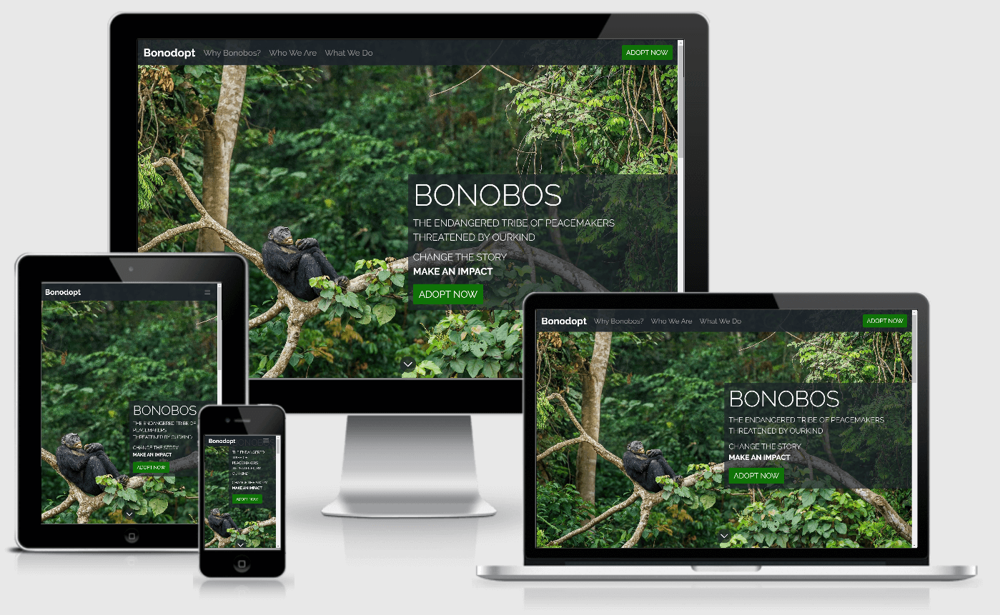
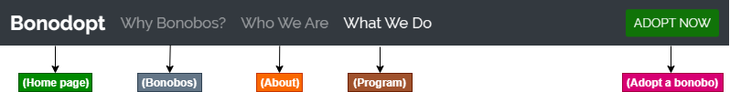
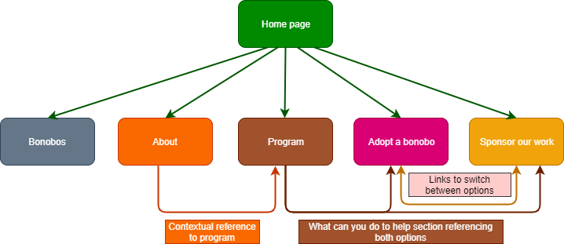
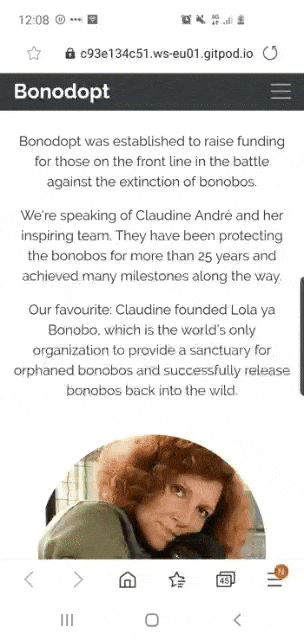

# Bonodopt 

 

## Make an impact - Adopt a bonobo 

I have always been greatly fascinated by our closest cousins - the bonobos. Not only do we share **98.7%** of our DNA, but even the social structures and behaviour can remind us of our own. 

The more you learn about them, the more you ask yourself: What makes us human? Why do we consider ourselves different from animals? The ability to learn another language? Bonobo Kanzi learned to communicate with 348 geometric symbols and understands about 3000 spoken English words. Surely not perfect, but still shows the ability to learn our language. Having sex for other reasons than reproduction? I think Bonobos are a step ahead of us there. Is it the use of tools and the ability to domesticate a fire? Well, check out [this](https://www.youtube.com/watch?v=EMbWDRzqNhc). 

Sadly, their population is believed to have declined sharply in the last 30 years. They only live in the Democratic Republic of the Congo and the years of civil unrest and poverty have made them vulnerable to habitat loss and hunting for bushmeat. 

The website has been created to increase awareness around the endangerment of Bonobos as well as raising funding for those working on the front line. Any visitor can inform himself about bonobos and their current situation, Bonodopt's program and contribute to support their work. While they live far away from us, it is still everybody's duty to look out for the vulnerable between us. I trust that this website is contributing in its own way and increasing the funds needed for their protection. 

While Bonodopt also takes donations, the main focus of the website lies in adopting a bonobo. This is to create a great first experience with the adoption kit and lay the path for further one-time or even monthly donations. Based on this, the website has been called Bonodopt, which is a neologism of bonobo and adopt. 

[Click here](https://anabelalealcosta19.github.io/bonodopt/) to go to Bonodopt's live website. 

## Table of Content

1. User Experience (UX) 
    - Goals
        - [User](#user)
        - [Stakeholder](#stakeholder)
    - [User Stories](#user-stories)
    - Design Choices
        - [Layout](#layout)
        - [Colour scheme](#colour-scheme)
        - [Images](#images)
        - [Typography](#typography) 
        - [Icons](#icons)
    - [Accessibility](#accessibility)
    - [Navigation](#navigation)
    - [Wireframes](#wireframes)
1. Features 
    - [Common features](#common-features)
    - Page specific features
        - [Home](#home)
        - [Bonobos](#bonobos)
        - [About](#about)
        - [Program](#program)
        - [Adopt](#adopt)
        - [Donate](#donate)
    - [Future considerations](#future-considerations)
1. Technologies used
    - [Languages](#languages)
    - [Libraries](#libraries)
    - [Tools](#tools)
1. Testing ******** To be done ********
1. Bugs 
    - [Fixed bugs](#fixed-bugs)
    - [Existing bugs](#existing-bugs)
1. Deployment
    - [Deploy project](#deploy-project)
    - [Deployed vs development version](#deployed-vs-development-version)
    - [Run code locally](#run-code-locally)
1. Credits
    - [Content](#content)
    - [Media](#media) 
    - [Code](#code) 
    - [Acknowledgements](#acknowledgements)
1. [Disclaimer](#disclaimer)

## User Experience (UX) 

### Goals

#### User

Bonodopt's website targets the following audience:
- English speaking
- Diverse *(gender, age, work, social status, nationality)*, but in private/ free time
- Want to make an impact/ do a good deed
- Has a heart for animals *(possibly also a fan of bonobos)*

User goals: 
- Make an impact/good deed through donating towards a Nonprofit organization or charity of my choice.
- Read more about Bonobos and their current situation.
- *Possibly: Make an impactful gift*.

Bonodopt is specialized on bonobos and has, therefore, a niche position in the donation sector. Once the user settles on bonobos, Bonodopt's website offers the ability to donate and adopt a bonobo and therefore do a good deed by supporting a valuable project. It furthermore offers a broad overview over bonobos, their situation, Bonodopt as an organization as well as their project. Apart from that, an adoption kit can be sent as a gift if desired. 

#### Stakeholder

Bonodopt Goals: 
- Increase number of donations and adoptions as well as total monetary income
- Build an online presence and increase reach 
- Present Bondopt as an organization in a reputable and trustworthy way
- Long-term retention of users to ensure further or monthly contributions

During the development of this project, each point has been considered to ensure the fulfillment of Bonodopt's goals. 

To increase the funding, the website strives to provide a very positive user experience as well as an emotional response through high-quality images to make the user follow through with his intention to contribute to Bonodopt's project. Furthermore, there has been made a point of focusing the website on "Adopt a bonobo" instead of donations. It's a great middle way between the best- and worst-case scenarios of receiving a donation (e.g. 50 $ monthly contributions vs 10 $ one-time donation). Besides, it's expected to be more convincing as a call to action since it's only a one-time commitment with further value for the user through the adoption kit.
 
For an increased reach and online presence, the implementation of SEO has been crucial. Important factors were also the ease of use and a reliable layout to present Bonodopt in a trustworthy way and have a throughout positive user experience to convince the user to return to Bonodopt's website at a later moment. 

### User stories 

- **User 1** ... is new to Bonodopt's website and wants to do a good deed
    1. I want to quickly gain an overview of the page to see if this website contains the information and services I am looking for.
    1. I want to easily navigate through the website to quickly find the most interesting content.
    1. I want to read more about bonobos to understand their personality and current situation.
    1. I want to review the about page to ensure that this is a serious organisation.
    1. I want to read more about the program to decide if this is a project I want to support.
    1. I want to review my options to make a contribution to decide what would be the best fit for me. 
    1. I want to make a contribution through the website to make a good deed. 

- **User 2** ... wants to learn more about bonobos
    1. I want to quickly gain an overview of the page to find more information about bonobos.
    1. I want to easily navigate to the bonobo section to read more about them.
    1. I want to review details about the owner of the website to verify if it's a legit source.
    1. I want to read more about their program to know more about the work that is being done to protect bonobos.
    1. I want to have a look at the linked social media profiles to see if there is further information or images.

- **User 3** ... has adopted a bonobo before and wants to make another contribution.
    1. I want to quickly review the options to decide whether to make a donation or adopt another bonobo.
    1. I want to review the requirements and possibilities when making a donation (e.g. minimum amount) to help me make a decision.
    1. I want to adopt another bonobo to receive another adoption kit. [OR]
    1. I want to be able to select my preferred options to be able to make a (for me) suitable donation.

- **User 4** ... has adopted a bonobo before and wants to make an impactful gift.
    1. I want to review the details of adopting a bonobo to decide whether I want to give this as a present.
    1. I want to quickly navigate to the form to adopt a bonobo.
    1. I want to have the possibility to mark this contribution as a gift to be able to have it wrapped up and/or sent to the recipient's address.

- **User 5** ... has filled out the form for adoption/donation, but never received an email.
    1. I want to verify that I was supposed to receive an email by double-checking the form and description of adopt a bonobo/ make a donation.
    1. I want to find the phone number to be able to discuss this issue on a call.
    1. I want to have the possibility to write a message to report my current issue (in case I cannot reach anyone via phone or if it's outside the working hours).

### Design Choices

#### Layout

The website is organised in a clean and structured way to suit the broad audience and to draw their attention to the content and images. 

The homepage is set up rather visually with little text to provide a quick overview. The further pages are rich in content, which is organized into different sections. Where needed, background and font colours have been changed to provide additional visual structure. The only exceptions are the forms, which are very simple and clean to avoid any possible distraction from filling out the form. 

Last but not least, the layout changes depending on the device size to ensure readability and ease of use. 

#### Colour scheme

Besides white and black, the two main colours are an intense green [rgb(16, 115, 8)] and a dark grey [rgba(29, 36, 42], which has been used with different levels of opacity. 

Both colours were selected from the hero image with the colour picker in the browser. Besides providing an appealing contrast, they also create an ideal frame for the content since the colours are repeated throughout most of the images (in the fur of bonobos and nature around them). Furthermore, the use of green is generally a good fit since conventionally used in projects related to nature. It naturally provides the user with the right association to introduce him gently to the topic. To improve readability, a brighter shade of green [rgb(22, 160, 11)] has been used for links. 

The only other colours used are a soft red [rgb(220,20,60)] and slightly golden yellow [rgb(249, 232,0)]. They are used symbolically with the heart and coin icon to enhance further visual incentives. 

#### Images

Images play a central role since they create the emotional response needed. All sections have been complemented with a high-quality image that fits the context and gives the user an additional sense of understanding. If needed, several crops of the same image have been made to ensure high quality and good positioning. 

#### Typography

Raleway is a very clean and easy to read font, which gives the website an elegant touch. At the same time, it is not overly prominent, which allows the images to take a more intense effect on the user. The only exception is the "W", which looks very eye-catching and provides modern styling to the navbar and headings, where this letter is heavily used. It gives an additional layer of style that fits into Bonodopt's overall appearance. 

To ensure consistency throughout the page this has been selected as the only font.

#### Icons

Most icons were used to provide visualisation and structure of sections with much content like e.g. "6 Reasons Why Bonobos" and "What Do We Do?". Even though those sections are divided into several subsections, the icons help to further break it down and make it easier to take in. Furthermore, the icons help to reference this content when summarized (e.g. on the home page or on a small device). 
 
In the call to action section on the home page, I used icons to signalize that "Adopt a bonobo" and "Sponsor our work" are clickable links by changing their color when hovering. Since this is quite different from the usual links and buttons used throughout this website, it makes them stand out. As the main objective of Bonodopt is to raise funding, this is thought to increase the likelihood to get the user to the form and its submission. 

Icons were furthermore used in the footer to keep it visually clean and create space. This enabled me to provide the user with two different options to get in touch as well as links to 5 different social media accounts without overwhelming him with a busy footer. 

### Accessibility

The accessibility of websites is an important factor when planning and creating a project. To ensure accessibility, the following points have been implemented:

* **Navbar:** The active navbar element is not only visually emphasized through styling but also with a hint. The hint "(current)" has been added for screen readers only and, therefore, point out to the user, on which page he's currently on.
* **Images:** To ensure that any images provided give additional context to the user, the alt attribute has always been included with a short image description. 
* **Icons:** When using  icons it has been ensured that these are always hidden from screen readers. In cases where icons where not only used for decorative purposes but are needed to be able to use a certain feature or access a certain link, additional information is provided to screen readers only. 
* **Special components:** All special components, such as the collapse element for mobiles, include the necessary accessibility attributes to make sure that those are always easy to use.
* **Forms:** In cases where labels for form inputs were not wanted due to design choices, they were still added for screen readers only to ensure accessibility. Furthermore, the "*aria-describedby*" attribute has been added in cases where a hint would come after the related input field.  
* **Validation:** Custom validation styles were added as native browser defaults are not announced to screen readers.

### Navigation

To ensure that a user can easily navigate between the pages without needing the browser's back button a standard navbar has been added. Furthermore, it has been implemented as a fixed navbar to not only allow the user to take advantage of it from all pages, but also from every page section. 

The navbar is structured as follows: 

Additionally, there can be contextual links in their main content to other pages as displayed below:

### Wireframes

These wireframes were created using [Balsamiq](https://balsamiq.com/?gclid=CjwKCAjwh472BRAGEiwAvHVfGsly1Nt9bDZCFUTGCc9I8OfaLtSIcxLhm_WX8911ERsm__luBJslTBoCqgQQAvD_BwE) during the design and planning process for this project. They have not been amended since the repository has been created and, therefore, display small differences when compared to the live website.

* [Home](assets/wireframes/home.pdf)
* [Bonobos](assets/wireframes/about.pdf)
* [Who We Are](assets/wireframes/about.pdf)
* [What We Do](assets/wireframes/program.pdf)
* [Form: Adopt a Bonobo](assets/wireframes/adopt.pdf)
* [Form: Donate](assets/wireframes/donate.pdf)

## Features

### Common features

The features described below are implemented throughout all pages. 

- **Navbar:** The Navbar allows the user to navigate throughout the pages.
    - The navbar includes the following elements: 
        1. Brand logo (Home page)
        1. Why Bonobos? (Bonobos)
        1. Who We Are (About)
        1. What We Do (Program)
        1. Small and medium devices: Adopt Now (Adopt a Bonobo)
        1. Large devices: Adopt Now button (Adopt a Bonobo)
    - It's a sticky navbar, meaning that the user can always navigate through the pages, even if currently at the page bottom.
    - On small and medium devices, the navbar collapses into a hamburger menu (containing elements 1-5) to keep the header clean whilst ensuring ease of use.
    - Adopt Now link on small and medium devices has been styled differently to still make it stand out to the user.
    - When hovering over navbar elements, the colour slightly changes to signalize that it's clickable (apart from the brand logo).
    - The active page is visualised through brightest font colour (apart from the brand logo).

- **Footer:** The footer provides the user with useful links and information
    - Contact us section
        - Message us
            - Envelope icon with changing background colour to indicate that it's clickable
            - When clicked opens a modal to send a message with send button to submit
            - Has "x" to dismiss modal even though it closes when clicking anywhere outside of modal
            - Modal includes bootstrap validation to ensure that all required fields have been filled out correctly by user
        - Call us 
            - Phone icon with changing background colour to indicate that it's clickable
            - When clicked a modal opens with phone number and availability for the user to call us
            - Has "x" to dismiss modal even though it closes when clicking anywhere outside of modal
    - Copyright with an indication that the project is for educational purposes only
    - Social links
        - Social media icons with changing background colour to indicate that it's clickable
        - Opens social media accounts in a new tab to enable user to browse

- **Buttons:** Same styling on buttons provides consistency across the website
    - All buttons are styled the same way for consistency (only exception: "Learn More" button in intro program)
    - Buttons slightly change colour when hovering to signalise that it's clickable

### Page specific features

#### Home

The home page contains small extracts with call to action buttons or links to lead to the detailed page. This has been implemented to provide the user with a quick overview and to gently guide him to the section of his highest interest. 
 
- **Callout section:** 
    - High-quality hero image with bonobo 
        - Softly introduces the user to the topic and objective of the website.
        - The image takes up the whole viewport and is responsive across different devices. 
    - "Adopt Now" button in Callout section
        - Promoting this so prominently increases the chances that the user clicks on it. 
    - Arrow down icon
        - Indicates to the user that more content is to come.
        - When clicking on it, the page scrolls down until the start of the content to improve the ease of use as well as user experience.

- **Intro program:** 
    - Program overview
        - The areas of the program are symbolised through 5 tiles/ boxes with an icon and a one-word description, which provides a great overview of a fairly detailed topic. 
        - The sixth tile with the question mark has been added for additional visualisation and to enhance the design. To emphasize that this is not part of the program, an opacity of 0.8 has been applied. 
    - Call to action button
        - As the tiles had a green background, the decision was made to choose an inversed style for this specific button. This creates a great contrast while adhering to the overall style of the buttons.       
        - When hovering over, it gets green as usually and signalizes that it's clickable.

- **Call to action section:** 
    - The options "Adopt a Bonobo" and "Sponsor our work" are displayed in a very simple and clean way.
    - The icons change colour when hovering over them to signalize that they're a link and enhance visual incentives to click on them. When clicked, the user is guided to the related form for its submission.

#### Bonobos

This page aims to introduce the user to bonobos, their personality, and why we should protect them. 

- **6 Reasons Why** 
    - Images
        - Information is structured into six blocks with a high emphasis on the images to create users compassion and increase its probability to make a contribution.
        - Small and medium devices display the images as rounded to create additional space.
    - Collapse
        - On small devices, the content is displayed in an accordion collapse to better structure the disclosure of information (since only one card block is opened at a time). 
        - This ensures that the user is not being overwhelmed with information and keeps a clean layout. 

#### About 

Here a user can find further information about Bondopt as an organization to assure himself that this is a reputable and trustworthy organisation. 

- **Heading**
    - The heading consists of an image and a quote to add a personal touch to the about section. 
    - Instead of assigning a specific size, they share the viewport height to ensure a consistent and responsive look across all devices. 
   
#### Program

This page provides the user with more detailed information into what the program does and how he can help Bonodopt to achieve it. 

- **Program section** 
    - Layout
        - The information is structured into five blocks with high emphasize on the images. 
        - The Rehabilitation section has a green background colour to create contrast and visual separation. Since this section has 3 subsections, it is a necessary step to not overwhelm the user. 
        - Small and medium devices display the images as rounded to create additional space.

    - Collapse
        - On small devices the content is displayed in an accordion collapse to better structure the disclosure of information (since only one card block is opened at a time). 
        - This keeps a clean layout although a lot of information is provided.

#### Adopt

- **Form** 
    - Input fields
        - Placeholder text used instead of labels to reduce the space taken up by the form. Since it's not a complicated form, the use of placeholder text has been considered as acceptable.
        - Hints have been given to improve user experience.    
        - Additional options provided: Adopt a bonobo as a gift, maximise its impact and sign up for the newsletter for more flexibility, additional functionality and user retention. 
    - Validation
        - Validation provided through Bootstrap for a customized message and styling.
    - Link to donation: Enable the customer to quickly change his mind and change to donation instead. 

#### Donate

- **Form** 
    - Input fields
        - Placeholder text used instead of labels to reduce the space taken up by the form. 
        - Hints have been given to improve user experience. 
        - Radio buttons have been used to specify required information. To influence the user, the more positive option (monthly and 50 $) are the first option and automatically pre-selected.
        - Additional option to sign up for the newsletter provided to improve user retention. 
    - Validation
        - Validation provided through Bootstrap for a customized message and styling.
    - Link to adoption: Enable the customer to quickly change his mind and change to adopt a bonobo instead. 

### Future considerations

- **Improve the scrolling behaviour of the arrow icon in the callout section**
    - When clicking on the arrow down icon in the callout section, the page should slowly scroll down to the bottom (instead of the start of content).  
    - As soon as the mouse moves, the scrolling behaviour should stop.
    - The slower scrolling, as well as scrolling to the bottom of the page, improves the UX.
- **Add conditional links to the intro program section**
    - Intro Program: Link the tiles/boxes to their respective content in "What We Do".
    - Since the mobile version uses the collapse feature, the link has to be conditional (depending on the device, the link leads to different sections in code).
- **Add "other" field to the donation form**
    - Add "other" field to donation form to enable the user to choose a different donation amount (increases flexibility).
    - Implement conditional validation: Only if the radio button "other" is selected, the following text field is required. 
    - Add additional requirements like minimum amount and possibly steps.
- **Provide feedback to the user when submitting adoption/ donation form** 
    - Improves UX since the customer can be sure that form submission worked out fine.
    - Can be achieved through a modal, but requires additional JavaScript to prevent the modal from appearing if form validation fails.
- **Initiate phone calls on mobile devices**
    - When clicking on the phone icon in the contact us section in the footer, the user should have the option to directly call the number provided (instead of only viewing it).
    - Ease of use and improved experience for the user.
- **Add the possibility to pay directly**
    - Improved UX as the user doesn't have to wait for email and instructions (contribution is immediately completed).
    - An important feature for the organisation as they would collect funds more quickly without risk of the user changing his mind.
- **Add Login**
    - Donations can be tracked and managed directly through the login page.
    - Better UX and enforces user retention.
- **Add FAQs** 
    - Enables the user to immediately find responses to his questions.
    - Reduces the amount of messages and calls initiated.

## Technologies Used

### Languages
This project uses mainly **HTML5** and **CSS3**. Additionally, **JavaScript** and **jquery** from [Bootstrap](https://getbootstrap.com/) has been added to support certain Bootstrap components and its form validation.

### Libraries
- [Bootstrap](https://getbootstrap.com/): Its grid, components and classes simplify the website structure and add additional responsiveness. 
- [Favicon.io](https://favicon.io/): Provides favicons to improve website recognition and branding.
- [Font Awesome](https://fontawesome.com/): Provides icons to simplify and visualise content and creates a better UX.
- [Google Fonts](https://fonts.google.com/): Used to style the website font.

### Tools 

- [Github](https://github.com/): Hosts the project files and was used to deploy the website to Git Pages.
- [Gitpod](https://www.gitpod.io/): Provides a developing environment to write code and commit changes to Github.
- [Git](https://git-scm.com/): Used for version control of the project.
- [Balsamiq](https://balsamiq.com/?gclid=CjwKCAjwh472BRAGEiwAvHVfGsly1Nt9bDZCFUTGCc9I8OfaLtSIcxLhm_WX8911ERsm__luBJslTBoCqgQQAvD_BwE): Used in the surface plane (UXD) to plan my project and create wireframes.
- [Nu HTML Checker](https://validator.w3.org/nu/): Validated my HTML code.
- [W3C CSS Validator](https://jigsaw.w3.org/css-validator/): Validate my CSS code.
- [FREEFORMATTER](https://www.freeformatter.com/): Indented my HTML, CSS and JS code
- [LetterCount](https://www.lettercount.com/): Counted letters of commit messages to ensure they aren't too long.
- [Scribens.com](https://www.scribens.com/): Checked grammar of website and readme content.
- [Optimizilla](https://imagecompressor.com/): Optimised images used in project.
- [Croppola](https://croppola.com/): Cropped images as needed (especially images for smaller devices).
- [Am I Responsive](http://ami.responsivedesign.is/): Used to display website across devices for screenshot in product introduction.
- [Tiny PNG](https://tinypng.com/): Additionally compressed images for my project. 
- [Diagram Editor](https://www.diagrameditor.com/): Used to create the diagrams for my readme.

## Testing

In this section, you need to convince the assessor that you have conducted enough testing to legitimately believe that the site works well. Essentially, in this part you will want to go over all of your user stories from the UX section and ensure that they all work as intended, with the project providing an easy and straightforward way for the users to achieve their goals.

Whenever it is feasible, prefer to automate your tests, and if you've done so, provide a brief explanation of your approach, link to the test file(s) and explain how to run them.

For any scenarios that have not been automated, test the user stories manually and provide as much detail as is relevant. A particularly useful form for describing your testing process is via scenarios, such as:

1. Contact form:
    1. Go to the "Contact Us" page
    2. Try to submit the empty form and verify that an error message about the required fields appears
    3. Try to submit the form with an invalid email address and verify that a relevant error message appears
    4. Try to submit the form with all inputs valid and verify that a success message appears.

In addition, you should mention in this section how your project looks and works on different browsers and screen sizes.

You should also mention in this section any interesting bugs or problems you discovered during your testing, even if you haven't addressed them yet.

If this section grows too long, you may want to split it off into a separate file and link to it from here.

## Bugs

### Fixed bugs

**Shrinking Navbar**

The navbar worked fine on the desktop, but when on small and medium devices the navbar shrinked when scrolling down. This furthermore only happened on the home page, "Bonobos" and "What We Do".

This makes the navbar hard to use, creates issues with the arrow down icon in the callout section (doesn't only show content but also a bit of callout section) and adds unneccessary and bothersome movement to the website. Overall, this does not provide a positive user experience. 

**Fix implemente:d** Some bootstrap rows were not correctly wrapped inside a container. This was causing some unhandled extra margin on that page as well as the issue with the navbar. Once this has been changed, the navbar worked as previously expected. 
Some elements were not correctly wrapped in a container, which caused performning issues of the 

### Existing bugs

At the moment, no existing bugs have been discovered.

## Deployment

### Deploy project

My project has been deployed to GitHub Pages. To do so, I completed the steps below:

1. Navigated to my repository "bonodopt"
2. Clicked on **Settings**
3. Under **GitHub Pages**, I used the **Source** drop-down menu and selected "master branch"
4. Clicked on **Save**

Once done, GitHub displayed the following message: " Your site is published at https://anabelalealcosta19.github.io/bonodopt/". I clicked on the link and could confirm that the website was successfully deployed. 

*Note: Use relative instead of absolute file paths to ensure that images are being displayed correctly.*

### Deployed vs development version

My Github Pages site is currently being built from the master brand. All changes have been saved, committed and pushed. Therefore, there should be no differences between the deployed and the development version.  

### Run code locally

To run code locally, the remote Github repository needs to be cloned. Cloning a repository pulls down a full copy of all the repository data that GitHub has at that point, including every file and folder of the project. Changes can be pushed to the remote Github repository at any time.

Find below the necessary steps to be able to run the code locally. The default instructions relate to Windows, any differences for Mac and Linux have been added in brackets. 

#### Cloning a repository using the command line
1. On GitHub, navigate to the main page of the repository.
1. Under the repository name, click **Clone or download**.
1. **Clone with HTTPS**: Click on the clipboard symbol beside the web URL to clone the repository using HTTPS. To clone using a SSH key (or certificate issued by the SSH certificate authority), click **Use SSH** and then the clipboard symbol.
1. Open Git Bash [*Mac & Linux: Open Terminal*].
1. Change the current working directory to the location you want the cloned directory. 
1. Type **git clone** and paste the URL you copied in step 3.
1. Press enter to create the local clone.

#### Cloning a repository to GitHub Desktop
1. Sign in to GitHub and GitHub Desktop before you start to clone.
1. On GitHub, navigate to the main page of the repository.
1. Under the repository name, click **Clone or download**.
1. **Clone with HTTPS**: Click on **Open in Desktop** to clone the repository and open it in GitHub Desktop.
1. Click **"Choose..."** and navigate to a local path where you want to clone the repository.
1. Click **Clone** to create the local clone.

## Credits

### Content

The content of my website was mainly sourced from [Lola ya Bonobo](https://www.lolayabonobo.org/), the world's only organization to provide a sanctuary for orphaned bonobos. 

Further input has been taken from the following sources: 
* [WWF Gifts](https://gifts.worldwildlife.org/gift-center/gifts/species-adoptions/bonobo.aspx)
* [World Animal Foundation - Adopt an animal kit](https://adoptananimalkits.ecwid.com/Adopt-A-Bonobo-p86316806)
* [Wikipedia article "Bonobo"](https://en.wikipedia.org/wiki/Bonobo)
* [Bonobo Handshake - Website and book](https://www.bonobohandshake.com/?page_id=25)
* [Wikipedia article "Vanessa Woods"](https://en.wikipedia.org/wiki/Vanessa_Woods)
* [AZ Quotes](https://www.azquotes.com/author/87796-Claudine_Andre)

Please note that the information from the mentioned sources has been combined and changed as necessary for my project. 

Any other text has been written by me. 

### Media

I exclusively used images as media for my website. Please find all images inclusive their source below: 

Page | Section | Image name(s) | Source | Image URL
---- | ------- | ------ | ------ | ------
Index | Callout | (1) hero-image-opt.jpeg, (2) hero-image-tablet.jpg, (3) hero-image-mobile.jpg | [Adobe Stock](https://stock.adobe.com/ie/) *(purchased)* | [here](https://stock.adobe.com/ie/images/bonobo-pan-paniscus-on-a-tree-branch/98710313?asset_id=98710313)
Index | Intro 'About' | home-claudine-opt-crop.jpg | [IMDb](https://www.imdb.com/?ref_=nv_home) | [here](https://www.imdb.com/title/tt1867988/mediaindex?ref_=tt_mv_close)
Index | Call to action | home-help-opt-crop.jpg | [Bonobo in Congo](https://www.bonoboincongo.com/) | [here](https://www.bonoboincongo.com/2013/11/09/from-kinshasa-oasis-to-lomami-wilderness-reflections-on-a-visit-with-bonobos/)
Bonobos | General | map-opt-crop.gif | [Cultural Anthropology](http://culturalanthropology.wikifoundry.com/) | [here](http://culturalanthropology.wikifoundry.com/page/Bonobos+Winter+2011) 
Bonobos | 6 Reasons why bonobos (Our closest living relative) | (1) our-closest-relative-lg-opt-crop.jpg, (2) our-closest-relative-opt-crop.jpg | [Poland In](https://polandin.com/) | [here](https://polandin.com/38051299/great-escape-chimpanzee-at-large-in-eastern-poland)
Bonobos | 6 Reasons why bonobos (Females are in charge) | (1) females-are-in-charge-lg-opt-crop.jpg, (2) females-are-in-charge-opt-crop.jpg | [ScienceNews](https://www.sciencenews.org/) | [here](https://www.sciencenews.org/article/pregnant-bonobos-get-little-delivery-help-their-friends) 
Bonobos | 6 Reasons why bonobos (Tribe of peacemakers) | (1) tribe-of-peacemakers-lg-opt-crop.jpg, (2) tribe-of-peacemakers-opt-crop.jpg | [BBC Worklife](https://www.bbc.com/worklife) | [here](https://www.bbc.com/worklife/article/20180925-with-females-in-charge-bonobo-society-is-more-chilled-out)
Bonobos | 6 Reasons why bonobos (Social beings) | (1) social-beings-lg-opt-crop.jpg, (2) social-beings-opt-crop.jpg | [EurekAlert](https://www.eurekalert.org/) | [here](https://www.eurekalert.org/multimedia/pub/120113.php)
Bonobos | 6 Reasons why bonobos (Bonobo handshake| (1) bonobo-handshake-lg-opt-crop.jpg, (2) bonobo-handshake-opt-crop.jpg | [Wallpaper Flare](https://www.wallpaperflare.com/) | [here](https://www.wallpaperflare.com/monkeys-bonobo-animal-ape-wallpaper-vmjl)
Bonobos | 6 Reasons why bonobos (Highly endangered) | (1) highly-endangered-lg-opt-crop.jpg, (2) highly-endangered-opt-crop.jpg | [global witness](https://www.globalwitness.org/en/) | [here](https://www.globalwitness.org/en/campaigns/oil-gas-and-mining/not-for-sale-salonga/)
About | Heading | claudine-and-bonobo-opt.png | [PASA](https://pasa.org/) | [here](https://pasa.org/awareness/a-reflection-on-claudine-andre-2/)
About | Heading | (1) claudine-andre-with-bonobo-family-md-opt-crop.jpg, (2) claudine-andre-with-bonobo-family-sm-opt-crop.jpg | [LaMeuse](https://www.lameuse.be/) | [here](https://www.lameuse.be/160682/article/2017-12-01/carolo-mag-claudine-carolo-du-bout-du-monde-lange-des-bonobos)
About | Bondopt | sanctuary-opt-crop.jpg | [At home and abroad](https://athomeandabroad.net/) | [here](https://athomeandabroad.net/tag/lola-ya-bonobo-nursery/)
About | Bondopt | nurses-with-bonobos-opt-crop.jpg | [At home and abroad](https://athomeandabroad.net/) | [here](https://athomeandabroad.net/tag/lola-ya-bonobo-nursery/)
About | Note | vanessa-woods-opt-crop.jpg | [PBS](https://www.pbs.org/) | [here](https://www.pbs.org/wgbh/nova/evolution/learning-bonobos.html)
Program | Program (Protect) | (1) bonobos-protect-opt.jpg, (2) bonobos-protect-mobile-opt-crop.jpg | [Lola ya Bonobo (twitter)](https://twitter.com/Lola_ya_Bonobo) | [here](https://twitter.com/Lola_ya_Bonobo/status/1187443642799022082)
Program | Program (Rescue) | (1) black-market-opt-crop.jpg, (2) black-market-mobile-opt-crop.jpg | [CNN](https://edition.cnn.com/) | [here](https://edition.cnn.com/2013/01/03/world/africa/lola-ya-bonobo-congo/index.html)
Program | Program (Rehabilitation) | bonobo-sick-opt-crop.jpg | [milwaukee journal sentinel](https://eu.jsonline.com/) | [here](https://eu.jsonline.com/story/news/local/milwaukee/2017/05/10/childrens-hospital-staff-help-save-bonobo/316693001/)
Program | Program (Rehabilitation) | substitute-mother-opt-crop.jpg | [MONGABAY](https://news.mongabay.com/) | [here](https://news.mongabay.com/2017/05/conservation-lessons-from-the-bonobos/)
Program | Program (Rehabilitation) | semi-wild-environment-opt-crop.jpg | [The Telegraph](https://www.telegraph.co.uk/) | [here](https://www.telegraph.co.uk/news/earth/earthpicturegalleries/8438057/Lola-ya-Bonobo-sanctuary-in-the-Democratic-Republic-of-Congo.html?image=2)
Program | Program (Release) | (1) wild-bonobo-opt.jpg, (2) wild-bonobo-mobile-opt-crop.jpg | [PHYS ORG](https://phys.org/) | [here](https://phys.org/news/2017-11-malaria-parasites-wild-bonobos.html)
Program | Program (Research) | (1) research-opt.jpg, (2) research-opt.jpg | [robertharding](https://www.robertharding.com/home/) | [here](https://www.robertharding.com/?lang=en&page=search&s=bonobo&smode=0&license=2&sortby=0&bgcolour=white&display=5)

The image in the project introduction of my readme file is a screenshot of my own website displayed in [Am I Responsive](http://ami.responsivedesign.is/) and therefore has no typical external source. 

### Code

Code has been used by me from the following sources: 

Language | Effect | Example | Source | URL
-------- | ------ | ------- | ------ | ---
HTML | Vertically align div | about.html, lines 64-66 | [medium](https://medium.com/) | [here](https://medium.com/wdstack/bootstrap-4-vertical-center-1211448a2eff)
HTML | Connect modal to link | index.html, lines 204-205 + 263 + 316 | [stackoverflow](https://stackoverflow.com/) | [here](https://stackoverflow.com/questions/22565247/bootstrap-modal-link)
CSS | Full width background-image | style.css, lines 307-313 | [CSS tricks](https://css-tricks.com/) | [here](https://css-tricks.com/perfect-full-page-background-image/)
CSS | Responsive font-size (applied to font-size but also height of containers/sections) | style.css, lines 322-323 |[stackoverflow](https://stackoverflow.com/) | [here](https://stackoverflow.com/questions/23560087/is-there-such-a-thing-as-min-font-size-and-max-font-size/39962030)
CSS | Scrolling smoothly | style.css, lines 19-20 | [Go Make Things](https://gomakethings.com/) |   [here](https://gomakethings.com/smooth-scrolling-links-with-only-css/)
CSS | Prevent page from scrolling behind fixed navbar | style.css, lines 361-362 | [Go Make Things](https://gomakethings.com/) | [here](https://gomakethings.com/how-to-prevent-anchor-links-from-scrolling-behind-a-sticky-header-with-one-line-of-css/)
CSS | Make icon appear lighter | style.css, lines 348-351 | [stackoverflow](https://stackoverflow.com/) | [here](https://stackoverflow.com/questions/28560118/want-to-make-font-awesome-icons-thinner)
CSS | Change icon colour when hovering over div (not only link itself) | style.css, lines 432-438 | [stackoverflow](https://stackoverflow.com/) | [here](https://stackoverflow.com/questions/13354157/css-changing-hover-effect-of-icon-font-in-a-link)
CSS | Icon background softly changing colour | style.css, lines 260-281 | [Code Institute](https://codeinstitute.net/) | [here](https://courses.codeinstitute.net/courses/course-v1:codeinstitute+FE+2017_T3/courseware/616289d66b5641a3808cc43e53842695/b51f7b8b815c4bcd9979d2281b6d97a9/1?activate_block_id=block-v1%3Acodeinstitute%2BFE%2B2017_T3%2Btype%40html%2Bblock%40afee41b412ef4289a600177505f1042f)
JS | Form Validation | adopt.html, lines 281-299 | [Bootstrap](https://getbootstrap.com/) | [here](https://getbootstrap.com/docs/4.0/components/forms/?#custom-styles]) *(Forms > Validation > Custom styles)* 

### Acknowledgements

I got the inspiration for this project when reading "Bonobo Handshake" by Vanessa Woods. It was a perfect fit for my first Milestone project since it's a topic I'm passionate about and where I just refreshed my knowledge. Furthermore, it was simply a good fit for a static website since it doesn't necessarily require advanced programming to fulfill the user's needs and expectations. 

A special thanks to my mentor [Rahul Lakhanpal](https://github.com/rahulkp220), who has provided me with valuable insights into best practices when building a website and how to create a great UX. I furthermore want to thank the slack community of Code Institute for reviewing my project and providing me with constructive criticism. 

Last but not least, I would like to point to [Lola ya Bonobo](https://www.lolayabonobo.org/). When reading through their website, it becomes very soon clear that they do incredibly valuable work and put so much love into it. If one is considering making a donation, this is a project that I can highly recommend. 

## Disclaimer

This website has been created for educational purposes only. 

Bonodopt as a Nonprofit organization and fund raiser doesn't exist. It includes existing people and programs, but any content has been combined out of different sources and changed as needed. For more details on those resources, please refer to the credit section above.  